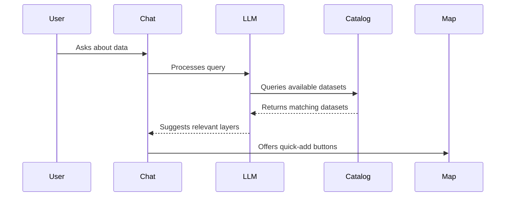

# Simple Geospatial Framework

## Project Structure
```
project/
├── backend/
│   ├── app/
│   │   ├── main.py          # FastAPI application
│   │   ├── routers/         # API route handlers
│   │   │   ├── map.py       # Map-related API endpoints
│   │   │   └── chat.py      # LLM chat API endpoints
│   │   ├── services/        # Business logic
│   │   │   ├── data_processing.py # Geospatial processing
│   │   │   └── llm.py       # LLM interaction logic
│   │   └── data/           # Data storage
│   ├── requirements.txt
│   └── Dockerfile
├── frontend/
│   ├── src/
│   │   ├── components/     # React components
│   │   │   ├── Map.jsx     # deck.gl implementation
│   │   │   ├── ChatWindow.jsx # Chat interface
│   │   │   └── Layout.jsx  # Main layout
│   │   ├── hooks/          # Custom hooks for API calls
│   │   │   ├── useFetchData.js # Hook for map data
│   │   │   └── useChat.js      # Hook for chat interactions
│   │   └── App.jsx         # Main application
│   ├── package.json
│   └── Dockerfile
├── docker-compose.yml
└── README.md

```


## Implementation Steps

1. **Backend Setup**
   - Initialize FastAPI project
   - Set up basic routes
   - Implement file storage
   - Add data processing logic

2. **Frontend Setup**
   - Create React project
   - Install deck.gl and dependencies
   - Set up basic map component
   - Add Tailwind CSS

3. **Integration**
   - Set up API calls
   - Implement data flow
   - Add error handling

4. **Docker**
   - Create Dockerfiles
   - Set up docker-compose
   - Test containerized setup

## Key Dependencies

### Backend
- fastapi
- uvicorn
- python-multipart (for file uploads)
- numpy (for data processing)

### Frontend
- react
- deck.gl
- react-map-gl
- tailwindcss
- axios (for API calls)

## Features
### 1. Dataset Discovery Flow




## Development Setup

### Docker Setup
```bash
docker-compose up --build
```

### Local Development Setup

#### Prerequisites
- Python 3.9+
- Node.js 18+
- npm
- Homebrew (for macOS)

#### Initial Setup
```bash
# Make the setup script executable
chmod +x scripts/local_setup.sh

# Run the setup script
./scripts/local_setup.sh
```

#### Running Locally

1. Backend:
```bash
# Activate virtual environment
source backend/venv/bin/activate

# Start backend server
cd backend
uvicorn app.main:app --reload
```

2. Frontend:
```bash
# In a new terminal
cd frontend
npm start
```

The application will be available at:
- Frontend: http://localhost:3000
- Backend API: http://localhost:8000

## Development Notes

- Local development uses a Python virtual environment (venv) located in `backend/venv/`
- Frontend hot reloading is enabled by default
- API documentation available at http://localhost:8000/docs